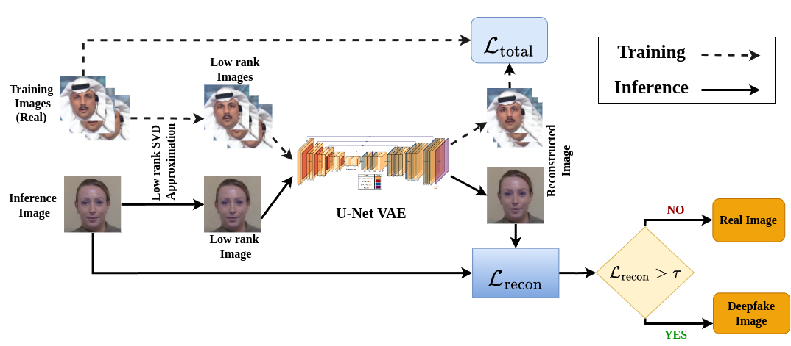

# 🧠 Unsupervised and Generalizable Deepfake Detection Using Singular Value Decomposition

 <!-- Replace with your actual image path -->

## 🔍 Overview

This project introduces an **unsupervised deepfake detection** pipeline based on **Singular Value Decomposition (SVD)**, aiming to identify deepfakes without relying on labeled training data. The method is designed to be **generalizable across datasets**, formats, and manipulation techniques.

The approach leverages the **spectral properties of image representations** to distinguish real from fake media, making it lightweight, interpretable, and adaptable.

---

## 🧪 Key Contributions

- ✅ **Unsupervised**: No need for annotated datasets.
- 🔁 **Generalizable**: Works across multiple deepfake datasets without retraining.
- 🔍 **SVD-Based**: Uses spectral signatures extracted via SVD for analysis.
- 📊 **Robust Evaluation**: Includes metrics, visualizations, and comparative benchmarks.

---

## 🛠️ Methodology

The process follows these main steps:

1. **Preprocessing** – Face detection and alignment.
2. **Feature Extraction** – Compute SVD of image regions or entire frames.
3. **Spectral Analysis** – Analyze singular values and vectors to detect anomalies.
4. **Decision** – Use unsupervised metrics to classify input as real or fake.

_See the diagram above for a visual summary._

---

## 📁 Folder Structure

