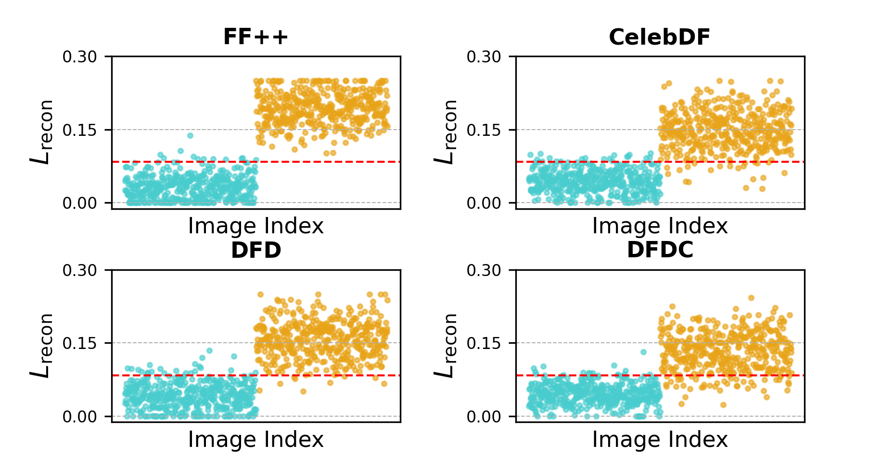

#  Unsupervised and Generalizable Deepfake Detection Using Singular Value Decomposition

 <!-- Replace with your actual image path -->

## 🔍 Overview

This project introduces an **unsupervised deepfake detection** pipeline that leverages **Singular Value Decomposition (SVD)** and **image reconstruction loss**. Unlike supervised techniques, our approach is **generalizable**, **interpretable**, and requires **no labeled training data**. It is designed to handle multiple datasets, manipulation schemes, and image perturbations like Gaussian blur and JPEG compression.

---

## 🧪 Key Contributions

- ✅ **Unsupervised**: No need for annotated datasets.
- 🔁 **Generalizable**: Trained on real data only, tested on six different deepfake datasets with diverse manipulation methods.
- 🔍 **Low-Rank SVD-Based**: We use a low-rank approximation of input images, retaining ~90% of spectral energy, to highlight anomalies.
- 🧠 **Reconstruction Loss Using U-Net VAE**: The reconstruction error of the low-rank input image is used as a classification criterion.
- 🛡️ **Robust to Perturbations**: Effective under Gaussian blur and JPEG compression scenarios.

---

## 🛠️ Methodology

The proposed pipeline consists of the following components:

### 1. Preprocessing
- Detect and align faces from the input image $$\(\mathbf{I} \in \mathbb{R}^{m \times n}\)$$.

### Low-Rank Reconstruction

Reconstruct a **low-rank version** $\mathbf{I}_{\text{low}}$ that retains approximately 90% of the spectral energy:

$$\mathbf{I}_{\text{low}} = \sum_{i=1}^{k} \sigma_i \mathbf{u}_i \mathbf{v}_i^T$$

Where $k$ is chosen such that:

$$
\frac{\sum_{i=1}^{k} \sigma_i^2}{\sum_{i=1}^{r} \sigma_i^2} \approx 0.90
$$

---

### 3. Image Reconstruction via U-Net VAE

- Feed $\mathbf{I}_{\text{low}}$ to a trained **U-Net Variational Autoencoder** to generate the reconstructed image $\hat{\mathbf{I}}$.
- The U-Net VAE is trained only on **real images** to learn their distribution using the following loss:

$$
\mathcal{L}_{\text{total}} = \mathcal{L}_{\text{MSE}} + \beta \mathcal{L}_{\text{KL}} + \lambda \mathcal{L}_{\text{L1}}
$$

Where:
- $\mathcal{L}_{\text{MSE}}$: Pixel-wise reconstruction error  
- $\mathcal{L}_{\text{KL}}$: KL divergence for latent regularization  
- $\mathcal{L}_{\text{L1}}$: Encourages sparsity and generalization

---

### 4. Anomaly Detection via Reconstruction Loss

- For an unseen image $\mathbf{I}^{\text{input}}$, compute reconstruction error:

$$
\mathcal{L}_{\text{recon}} = \frac{1}{mn} \sum_{i=1}^{m} \sum_{j=1}^{n} \left( \mathbf{I}^{\text{input}}_{i,j} - \hat{\mathbf{I}}_{i,j} \right)^2
$$

- Determine threshold $\tau^*$ from a validation set using **Youden’s Index**:

$$
\tau^* = \arg\max_{\tau} \left[ \int_{\tau}^{\infty} p_f(x) \, dx + \int_{-\infty}^{\tau} p_r(x) \, dx - 1 \right]
$$

- Classify as:
  - **Real** if $\mathcal{L}_{\text{recon}} \leq \tau^*$
  - **Fake** if $\mathcal{L}_{\text{recon}} > \tau^*$

## 📊 Experiments & Evaluation

### 📂 Cross-Dataset Evaluation (6 datasets)

### ✅ Model Trained on FF++-c23

Cross-dataset evaluations using the **frame-level ROC-AUC** metric. All detectors are trained on **FF++-c23** and evaluated on other datasets.

| Method    | Detector         | Backbone      | CDF-v1       | CDF-v2       | DFD          | DFDC         | DFDCP        | Avg.         |
|-----------|------------------|---------------|--------------|--------------|--------------|--------------|--------------|--------------|
| Naive     | Meso4            | MesoNet       | 0.736        | 0.609        | 0.548        | 0.556        | 0.599        | 0.610        |
| Naive     | MesoIncep        | MesoNet       | 0.737        | 0.697        | 0.623        | 0.576        | 0.684        | 0.663        |
| Naive     | CNN-Aug          | ResNet        | 0.742        | 0.703        | 0.646        | 0.636        | 0.617        | 0.669        |
| Naive     | Xception         | Xception      | 0.791        | 0.739        | 0.816        | 0.680        | 0.737        | 0.753        |
| Naive     | EfficientB4      | EfficientNet  | 0.791        | 0.749        | 0.815        | 0.696        | 0.728        | 0.756        |
| Spatial   | CapsuleNet       | Capsule       | 0.791        | 0.747        | 0.684        | 0.647        | 0.657        | 0.705        |
| Spatial   | FWA              | Xception      | 0.719        | 0.710        | 0.667        | 0.638        | 0.690        | 0.685        |
| Spatial   | Face X-ray       | HRNet         | 0.709        | 0.679        | 0.766        | 0.633        | 0.694        | 0.696        |
| Spatial   | FFD              | Xception      | 0.780        | 0.748        | 0.780        | 0.734        | 0.753        | 0.759        |
| Spatial   | CORE             | Xception      | 0.780        | 0.743        | 0.802        | 0.743        | 0.753        | 0.754        |
| Spatial   | Recce            | Custom        | 0.768        | -            | 0.812        | 0.713        | 0.734        | 0.752        |
| Spatial   | UCF              | Xception      | 0.779        | -            | 0.810        | 0.759        | 0.763        | 0.778        |
| Frequency | F3Net            | Xception      | 0.777        | 0.735        | 0.798        | 0.702        | 0.735        | 0.749        |
| Frequency | SPSL             | Xception      | 0.815        | 0.726        | 0.804        | 0.741        | 0.761        | 0.769        |
| Frequency | SRM              | Xception      | 0.793        | 0.755        | 0.812        | 0.704        | 0.741        | 0.760        |
| Frequency | EFNB4 + LSDA     | EfficientNet  | <u>0.867</u> | <u>0.830</u> | <u>0.880</u> | <u>0.736</u> | <u>0.815</u> | <u>0.826</u> |
| **SVD (Ours)** | U-Net VAE   | U-Net VAE     | <b>0.892</b> (+0.025) | <b>0.876</b> (+0.046) | <b>0.890</b> (+0.010) | <b>0.834</b> (+0.098) | <b>0.903</b> (+0.088) | <b>0.881</b> (+0.055) |

#### ✅ Model Trained on CDF-v2

Cross-dataset evaluations using the **frame-level ROC-AUC** metric. All detectors are trained on **CDF-v2** and evaluated on other datasets.

| Method    | Detector         | Backbone      | CDF-v1       | FF++         | DFD          | DFDC         | DFDCP        | Avg.         |
|-----------|------------------|---------------|--------------|--------------|--------------|--------------|--------------|--------------|
| Naive     | Meso4            | MesoNet       | 0.701        | 0.679        | 0.577        | 0.541        | 0.603        | 0.620        |
| Naive     | MesoIncep        | MesoNet       | 0.723        | 0.707        | 0.620        | 0.563        | 0.678        | 0.658        |
| Naive     | CNN-Aug          | ResNet        | 0.735        | 0.720        | 0.645        | 0.627        | 0.618        | 0.669        |
| Naive     | Xception         | Xception      | 0.776        | 0.758        | 0.813        | 0.687        | 0.740        | 0.755        |
| Naive     | EfficientB4      | EfficientNet  | 0.780        | 0.762        | 0.810        | 0.705        | 0.729        | 0.757        |
| Spatial   | CapsuleNet       | Capsule       | 0.780        | 0.759        | 0.688        | 0.650        | 0.661        | 0.708        |
| Spatial   | FWA              | Xception      | 0.710        | 0.720        | 0.675        | 0.638        | 0.692        | 0.687        |
| Spatial   | Face X-ray       | HRNet         | 0.696        | 0.682        | 0.768        | 0.637        | 0.695        | 0.696        |
| Spatial   | FFD              | Xception      | 0.763        | 0.758        | 0.785        | 0.736        | 0.755        | 0.759        |
| Spatial   | CORE             | Xception      | 0.765        | 0.751        | 0.807        | 0.744        | 0.755        | 0.764        |
| Spatial   | Recce            | Custom        | 0.755        | -            | 0.816        | 0.715        | 0.738        | 0.756        |
| Spatial   | UCF              | Xception      | 0.771        | -            | 0.814        | 0.765        | 0.760        | 0.778        |
| Frequency | F3Net            | Xception      | 0.760        | 0.745        | 0.800        | 0.706        | 0.735        | 0.749        |
| Frequency | SPSL             | Xception      | 0.799        | 0.736        | 0.804        | 0.749        | 0.767        | 0.771        |
| Frequency | SRM              | Xception      | 0.782        | 0.764        | 0.818        | 0.710        | 0.742        | 0.763        |
| Frequency | EFNB4 + LSDA     | EfficientNet  | <u>0.857</u> | <u>0.838</u> | <u>0.882</u> | <u>0.744</u> | <u>0.818</u> | <u>0.827</u> |
| **SVD (Ours)** | U-Net VAE   | U-Net VAE     | **0.881** (+0.024) | **0.896** (+0.058) | **0.899** (+0.017) | **0.839** (+0.095) | **0.910** (+0.092) | **0.885** (+0.058) |

### ✅ Model Trained on **CDF-v1**

Cross-dataset evaluations using the **frame-level ROC-AUC** metric. All detectors are trained on **CDF-v1** and evaluated on other datasets.

| Method    | Detector         | Backbone      | CDF-v2       | FF++         | DFD          | DFDC         | DFDCP        | Avg.         |
|-----------|------------------|---------------|--------------|--------------|--------------|--------------|--------------|--------------|
| Naive     | Meso4            | MesoNet       | 0.715        | 0.662        | 0.569        | 0.535        | 0.598        | 0.616        |
| Naive     | MesoIncep        | MesoNet       | 0.731        | 0.688        | 0.613        | 0.550        | 0.670        | 0.650        |
| Naive     | CNN-Aug          | ResNet        | 0.740        | 0.702        | 0.628        | 0.620        | 0.605        | 0.659        |
| Naive     | Xception         | Xception      | 0.781        | 0.740        | 0.795        | 0.675        | 0.729        | 0.744        |
| Naive     | EfficientB4      | EfficientNet  | 0.783        | 0.752        | 0.801        | 0.699        | 0.715        | 0.750        |
| Spatial   | CapsuleNet       | Capsule       | 0.769        | 0.742        | 0.678        | 0.642        | 0.648        | 0.696        |
| Spatial   | FWA              | Xception      | 0.722        | 0.705        | 0.661        | 0.625        | 0.684        | 0.679        |
| Spatial   | Face X-ray       | HRNet         | 0.709        | 0.668        | 0.762        | 0.626        | 0.690        | 0.691        |
| Spatial   | FFD              | Xception      | 0.765        | 0.746        | 0.775        | 0.725        | 0.745        | 0.751        |
| Spatial   | CORE             | Xception      | 0.769        | 0.738        | 0.790        | 0.735        | 0.748        | 0.756        |
| Spatial   | Recce            | Custom        | 0.750        | -            | 0.806        | 0.704        | 0.729        | 0.747        |
| Spatial   | UCF              | Xception      | 0.765        | -            | 0.804        | 0.754        | 0.749        | 0.768        |
| Frequency | F3Net            | Xception      | 0.751        | 0.736        | 0.795        | 0.700        | 0.720        | 0.740        |
| Frequency | SPSL             | Xception      | 0.789        | 0.727        | 0.798        | 0.742        | 0.760        | 0.763        |
| Frequency | SRM              | Xception      | 0.774        | 0.756        | 0.809        | 0.705        | 0.735        | 0.756        |
| Frequency | EFNB4 + LSDA     | EfficientNet  | <u>0.842</u> | <u>0.825</u> | <u>0.875</u> | <u>0.738</u> | <u>0.805</u> | <u>0.817</u> |
| **SVD (Ours)** | U-Net VAE   | U-Net VAE     | **0.869** (+0.027) | **0.881** (+0.056) | **0.894** (+0.019) | **0.828** (+0.090) | **0.899** (+0.094) | **0.874** (+0.057) |

### ✅ Model Trained on **DFD**

Cross-dataset evaluations using the **frame-level ROC-AUC** metric. All detectors are trained on **DFD** and evaluated on other datasets.

| Method    | Detector         | Backbone      | CDF-v2       | FF++         | CDF-v1       | DFDC         | DFDCP        | Avg.         |
|-----------|------------------|---------------|--------------|--------------|--------------|--------------|--------------|--------------|
| Naive     | Meso4            | MesoNet       | 0.708        | 0.660        | 0.621        | 0.544        | 0.596        | 0.626        |
| Naive     | MesoIncep        | MesoNet       | 0.733        | 0.679        | 0.639        | 0.580        | 0.660        | 0.658        |
| Naive     | CNN-Aug          | ResNet        | 0.741        | 0.695        | 0.664        | 0.610        | 0.630        | 0.668        |
| Naive     | Xception         | Xception      | 0.779        | 0.743        | 0.755        | 0.695        | 0.718        | 0.738        |
| Naive     | EfficientB4      | EfficientNet  | 0.792        | 0.755        | 0.769        | 0.710        | 0.736        | 0.752        |
| Spatial   | CapsuleNet       | Capsule       | 0.768        | 0.727        | 0.684        | 0.660        | 0.671        | 0.702        |
| Spatial   | FWA              | Xception      | 0.739        | 0.705        | 0.672        | 0.648        | 0.689        | 0.691        |
| Spatial   | Face X-ray       | HRNet         | 0.726        | 0.680        | 0.688        | 0.640        | 0.703        | 0.687        |
| Spatial   | FFD              | Xception      | 0.775        | 0.740        | 0.755        | 0.720        | 0.750        | 0.748        |
| Spatial   | CORE             | Xception      | 0.782        | 0.749        | 0.758        | 0.738        | 0.765        | 0.758        |
| Spatial   | Recce            | Custom        | 0.767        | -            | 0.739        | 0.708        | 0.727        | 0.735        |
| Spatial   | UCF              | Xception      | 0.782        | -            | 0.745        | 0.756        | 0.760        | 0.761        |
| Frequency | F3Net            | Xception      | 0.751        | 0.725        | 0.706        | 0.685        | 0.730        | 0.719        |
| Frequency | SPSL             | Xception      | 0.784        | 0.732        | 0.768        | 0.740        | 0.765        | 0.758        |
| Frequency | SRM              | Xception      | 0.772        | 0.754        | 0.782        | 0.718        | 0.748        | 0.755        |
| Frequency | EFNB4 + LSDA     | EfficientNet  | <u>0.836</u> | <u>0.820</u> | <u>0.830</u> | <u>0.772</u> | <u>0.798</u> | <u>0.811</u> |
| **SVD (Ours)** | U-Net VAE   | U-Net VAE     | **0.861** (+0.025) | **0.873** (+0.053) | **0.867** (+0.037) | **0.832** (+0.060) | **0.881** (+0.083) | **0.863** (+0.052) |

### ✅ Model Trained on **DFDC**

Cross-dataset evaluations using the **frame-level ROC-AUC** metric. All detectors are trained on **DFDC** and evaluated on other datasets.

| Method    | Detector         | Backbone      | CDF-v2       | FF++         | CDF-v1       | DFD          | DFDCP        | Avg.         |
|-----------|------------------|---------------|--------------|--------------|--------------|--------------|--------------|--------------|
| Naive     | Meso4            | MesoNet       | 0.652        | 0.610        | 0.594        | 0.574        | 0.550        | 0.596        |
| Naive     | MesoIncep        | MesoNet       | 0.679        | 0.628        | 0.615        | 0.603        | 0.581        | 0.621        |
| Naive     | CNN-Aug          | ResNet        | 0.692        | 0.644        | 0.629        | 0.620        | 0.608        | 0.639        |
| Naive     | Xception         | Xception      | 0.735        | 0.700        | 0.720        | 0.680        | 0.658        | 0.699        |
| Naive     | EfficientB4      | EfficientNet  | 0.754        | 0.719        | 0.740        | 0.699        | 0.670        | 0.716        |
| Spatial   | CapsuleNet       | Capsule       | 0.721        | 0.682        | 0.663        | 0.648        | 0.627        | 0.668        |
| Spatial   | FWA              | Xception      | 0.699        | 0.659        | 0.650        | 0.630        | 0.621        | 0.652        |
| Spatial   | Face X-ray       | HRNet         | 0.685        | 0.641        | 0.644        | 0.609        | 0.604        | 0.637        |
| Spatial   | FFD              | Xception      | 0.742        | 0.715        | 0.736        | 0.710        | 0.700        | 0.721        |
| Spatial   | CORE             | Xception      | 0.753        | 0.727        | 0.742        | 0.725        | 0.710        | 0.731        |
| Spatial   | Recce            | Custom        | 0.734        | -            | 0.711        | 0.693        | 0.685        | 0.706        |
| Spatial   | UCF              | Xception      | 0.745        | -            | 0.722        | 0.710        | 0.705        | 0.721        |
| Frequency | F3Net            | Xception      | 0.715        | 0.690        | 0.672        | 0.656        | 0.648        | 0.676        |
| Frequency | SPSL             | Xception      | 0.739        | 0.710        | 0.734        | 0.712        | 0.693        | 0.717        |
| Frequency | SRM              | Xception      | 0.728        | 0.703        | 0.746        | 0.700        | 0.715        | 0.718        |
| Frequency | EFNB4 + LSDA     | EfficientNet  | <u>0.790</u> | <u>0.767</u> | <u>0.779</u> | <u>0.740</u> | <u>0.735</u> | <u>0.762</u> |
| **SVD (Ours)** | U-Net VAE   | U-Net VAE     | **0.834** (+0.044) | **0.841** (+0.074) | **0.820** (+0.041) | **0.789** (+0.049) | **0.804** (+0.069) | **0.818** (+0.056) |

### ✅ Model Trained on **DFDCP**

Cross-dataset evaluations using the **frame-level ROC-AUC** metric. All detectors are trained on **DFDCP** and evaluated on other datasets.

| Method    | Detector         | Backbone      | CDF-v2       | FF++         | CDF-v1       | DFD          | DFDC         | Avg.         |
|-----------|------------------|---------------|--------------|--------------|--------------|--------------|--------------|--------------|
| Naive     | Meso4            | MesoNet       | 0.640        | 0.608        | 0.595        | 0.570        | 0.545        | 0.592        |
| Naive     | MesoIncep        | MesoNet       | 0.662        | 0.628        | 0.611        | 0.599        | 0.578        | 0.616        |
| Naive     | CNN-Aug          | ResNet        | 0.689        | 0.651        | 0.630        | 0.615        | 0.600        | 0.637        |
| Naive     | Xception         | Xception      | 0.735        | 0.698        | 0.710        | 0.684        | 0.667        | 0.699        |
| Naive     | EfficientB4      | EfficientNet  | 0.747        | 0.715        | 0.734        | 0.705        | 0.684        | 0.717        |
| Spatial   | CapsuleNet       | Capsule       | 0.711        | 0.677        | 0.654        | 0.640        | 0.623        | 0.661        |
| Spatial   | FWA              | Xception      | 0.703        | 0.660        | 0.645        | 0.625        | 0.607        | 0.648        |
| Spatial   | Face X-ray       | HRNet         | 0.684        | 0.639        | 0.630        | 0.610        | 0.600        | 0.633        |
| Spatial   | FFD              | Xception      | 0.745        | 0.712        | 0.726        | 0.712        | 0.700        | 0.719        |
| Spatial   | CORE             | Xception      | 0.758        | 0.720        | 0.734        | 0.720        | 0.707        | 0.728        |
| Spatial   | Recce            | Custom        | 0.729        | -            | 0.706        | 0.690        | 0.676        | 0.700        |
| Spatial   | UCF              | Xception      | 0.739        | -            | 0.716        | 0.705        | 0.698        | 0.715        |
| Frequency | F3Net            | Xception      | 0.711        | 0.689        | 0.660        | 0.653        | 0.643        | 0.671        |
| Frequency | SPSL             | Xception      | 0.737        | 0.704        | 0.726        | 0.715        | 0.698        | 0.716        |
| Frequency | SRM              | Xception      | 0.728        | 0.702        | 0.739        | 0.699        | 0.712        | 0.716        |
| Frequency | EFNB4 + LSDA     | EfficientNet  | <u>0.786</u> | <u>0.760</u> | <u>0.774</u> | <u>0.738</u> | <u>0.728</u> | <u>0.757</u> |
| **SVD (Ours)** | U-Net VAE   | U-Net VAE     | **0.829** (+0.043) | **0.838** (+0.078) | **0.815** (+0.041) | **0.782** (+0.044) | **0.800** (+0.072) | **0.813** (+0.056) |

### 🧪 Cross-Manipulation Evaluation (4 types)
#### Trained on DF

| **Method**               | **DF** | **F2F** | **FS**  | **NT**  |
|--------------------------|--------|--------|--------|--------|
| Face X-ray + BI          | 0.9917 | 0.9857 | 0.9821 | 0.9813 |
| PCL + I2G                | 1.0000 | 0.9897 | 0.9986 | 0.9765 |
| EFNB4 + SBIs             | 0.9999 | 0.9988 | 0.9991 | 0.9879 |
| **Ours**                 | 0.9975 | 0.9798 | 0.9934 | 0.9852 |

---

#### Trained on F2F

| **Method**               | **F2F** | **DF**  | **FS**  | **NT**  |
|--------------------------|--------|--------|--------|--------|
| Face X-ray + BI          | 0.9883 | 0.9812 | 0.9794 | 0.9756 |
| PCL + I2G                | 0.9937 | 0.9821 | 0.9879 | 0.9713 |
| EFNB4 + SBIs             | 0.9989 | 0.9956 | 0.9964 | 0.9815 |
| **Ours**                 | 0.9796 | 0.9754 | 0.9882 | 0.9767 |

---

#### Trained on FS

| **Method**               | **FS**  | **DF**  | **F2F** | **NT**  |
|--------------------------|--------|--------|--------|--------|
| Face X-ray + BI          | 0.9875 | 0.9806 | 0.9778 | 0.9701 |
| PCL + I2G                | 0.9961 | 0.9865 | 0.9893 | 0.9692 |
| EFNB4 + SBIs             | 0.9978 | 0.9924 | 0.9947 | 0.9785 |
| **Ours**                 | 0.9892 | 0.9789 | 0.9826 | 0.9743 |

---

#### Trained on NT

| **Method**               | **NT**  | **DF**  | **F2F** | **FS**  |
|--------------------------|--------|--------|--------|--------|
| Face X-ray + BI          | 0.9822 | 0.9769 | 0.9745 | 0.9753 |
| PCL + I2G                | 0.9896 | 0.9801 | 0.9824 | 0.9819 |
| EFNB4 + SBIs             | 0.9963 | 0.9917 | 0.9925 | 0.9904 |
| **Ours**                 | 0.9855 | 0.9736 | 0.9802 | 0.9811 |

### 🔍 Reconstruction Loss Visualization Across Training Datasets

This section presents the reconstruction loss ($\mathcal{L}_{\text{recon}}$) distribution of real and fake samples. The model is trained on different datasets, and evaluated across test datasets like FF++, CelebDF, DFD, DFDC. The threshold $\tau^*$ is computed on the validation set of the respective training dataset.

Each plot helps in understanding how well the model trained on a specific dataset generalizes to unseen data.

---

#### ✅ Trained on FF++

When trained on **FF++**, the model shows excellent separation between real and fake samples, especially on the FF++ and CelebDF test sets. The threshold $\tau^*$ effectively distinguishes the classes.

---

#### 🔵 Trained on DFD

The model trained on **DFD** shows clean separation on DFD and FF++, while the margin is narrower on DFDC and DFDCP. Still, the $\tau^*$ threshold maintains good discriminative power.

---

#### 🟢 Trained on CDFv1

With **CDFv1** training, the model generalizes fairly well. The loss distribution suggests strong separation on CelebDF and moderate separation on DFD and DFDC.

---

#### 🟠 Trained on DFDC

Training on **DFDC**, which is diverse and noisy, results in wider reconstruction loss distributions. Despite that, the model retains good real-vs-fake separation and remains robust across datasets.

---

These plots highlight how training data diversity and manipulation types affect generalization in reconstruction-based detection frameworks.

---
### 🎯 Effect of Threshold on ROC-AUC
_How varying the decision threshold affects ROC-AUC and detection robustness._

This section analyzes how ROC-AUC scores vary as a function of the decision threshold ($\tau$) when models are trained on different datasets. The optimal threshold $\tau^*$ is determined using a validation subset of the training dataset.

---

#### ✅ Trained on FF++

The FF++-trained model shows a sharp peak around the optimal threshold $\tau^*$. This indicates high sensitivity to thresholding, with strong performance in discriminating between real and fake samples.

---

#### 🔵 Trained on DFD

When trained on DFD, the AUC curve is more stable across a wider threshold range, indicating robust generalization. The performance does not degrade significantly outside the optimal region.

---

#### 🟢 Trained on CDFv1

For CDFv1-trained models, the AUC response to threshold variation is less sharp, implying that the classifier has a broader margin for decision-making. This could be useful in noisy environments.

---

#### 🟣 Trained on CDFv2

Training on CDFv2 yields a more defined peak around $\tau^*$, suggesting stronger confidence in decision boundaries. It reflects improvements over CDFv1 in terms of robustness and precision.

---

#### 🟠 Trained on DFDC

DFDC-trained models tend to be less stable with respect to threshold tuning. The curve fluctuates, likely due to the dataset's variability. However, optimal regions still yield decent performance.

---

#### 🟡 Trained on DFDCP

DFDCP training results in relatively consistent AUC performance over a larger threshold window. This makes it more resilient to slight misestimations of $\tau$.

---

These analyses underscore the importance of choosing the right threshold for each training scenario, and demonstrate how training datasets influence sensitivity and stability in ROC-AUC performance.

## 🤝 Contributions

---

## 📜 License

